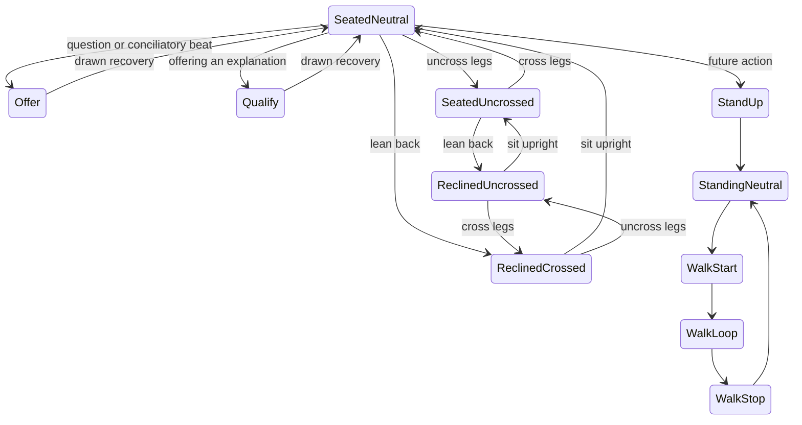

# Drawing-based character animation

## Decision

Build the narrative game around **authored poses and transition drawings**.
This replaces the earlier proposal to use a deforming skeletal character rig.
Keep the Simpsons-style visual language: expressive silhouettes, bold black
outlines, flat colors and three fingers plus one thumb. The eventual game host
will be an original character with a different face, hair, clothing and silhouette.

The reusable foundation is a character/action interface. Reuse names, playback,
scene placement and conversational meanings; draw the actual performance for
each character. A skeleton is not the foundation of the image.

## How drawings move

An action is a timed sequence of saved drawings: anticipation, transition, hold
and recovery. The mouth system already works this way. Opening a hand, turning
a head, crossing legs or making a large reaction can change the silhouette
through newly drawn in-betweens. Playback never invents an intermediate hand
by warping pixels, stretching bones or crossfading two outlines.

Choose animation units to preserve the drawing:

- Seated conversations: body, complete arm/hand poses, face, eyes and legs.
- An arm gesture: usually replace the whole arm, including the hand and cuff.
- A lean: replace the torso drawing; reuse approved whole arms with authored
  rigid placements where their silhouettes still fit. Keep the arms separate.
- A larger reaction: author additional arm poses only when the existing ones
  cannot express the new silhouette.
- Walking: coordinated whole-body drawings; optionally an independent head.
- Sitting, standing, turning and reaching: dedicated action sequences.

Small rigid placement changes are useful for registration. Moving a complete
character through a scene and scaling it uniformly do not deform its anatomy.
Whole-arm sprites may translate and rotate around their shoulder attachment.
These placements are fixed for each drawn pose, not a deforming arm skeleton.
A new viewing angle requires corresponding drawings. A flat image cannot supply
arbitrary perspectives just because the playback system is general.

## Character package and state graph

A package contains a local origin, hashed drawings with local positions, named
poses, action clips, state definitions and independently selectable overlays.
A pose can contain one whole-body drawing or several ordered pieces. A clip
refers to poses and integer frame durations. It is independent of dialogue,
character identity, scene coordinates and whether the pose is seated or standing.

Most gestures return through neutral, limiting the number of transition pairs.
Neutral means the current settled posture. Reclining and uncrossing persist
after their transition; gestures recover to that posture. Semantic requests
resolve to the clip for the actor's current or already-committed destination
state, so a queued gesture never snaps a reclined speaker upright.
Common direct transitions can be authored later. An interrupt stops speech
immediately; the current short gesture finishes its drawn recovery. A subsequent
gesture is queued until that recovery completes. Missing actions and poses are
errors, not substitutions with unrelated artwork.

Each character can have different proportions, frame timing and performance.
Shared semantic requests such as `offer` and `concede` select character-specific
clips. Anatomical left/right identity belongs to the drawings; screen position
never determines which hand to use, and the player never mirrors a limb.

## Furniture and depth

The chair and the person are separate assets. Split furniture into rear and
foreground layers:

1. Chair back, seat and far arm.
2. Character's seated legs, hips and torso.
3. Chair's near arm.
4. Character's near hand/forearm when resting over that arm.

The body sits *inside* the chair arms. A hand can rest on the foreground arm.
A pose can change its layer order when a gesture passes behind or in front of
something. Trouser contours also render above far sleeves where they overlap.
Joint and overlap contours are preserved in the source drawings and masks.
An uncrossed lower body has separately authored rear and front drawings:
the seat/waist behind the jacket, and the forward thighs above it. The front
drawing excludes the rear hip mass and has its own continuous inked boundary.
Its rear edge emerges at seat height and rises toward the knee; treating the
whole hip as foreground makes the legs appear to grow from the abdomen.
The rear drawing must include the entire seated butt down to cushion contact;
cropping a waist strip leaves a visible hole beneath the jacket. It can persist
unchanged while the forward leg drawings switch poses.
The jacket must have a complete drawn hem, including fabric that was hidden
by a crossed knee in the reference. A reclined torso has a broad collar opening
matched to the unchanged head, plus a front-collar cutout above the neck base.
The cutout includes the complete ink rim and sits below the animated jaw.
Remove placeholder neck stubs from headless torso art, and remove old neck
fragments outside a replacement portrait's silhouette, especially below ears.
Moving silhouettes must exclude the old room pixels even when those pixels
were invisible against the original stationary background.
The coffee table and cups have their own foreground layer so moving legs can
pass behind them. Room-plate pixels are not sufficient foreground occlusion.

Scenes own furniture, actor seat positions, camera composition and eye-contact
targets. Character packages own local drawings and attachment positions. A
cigarette tip or cup grip follows the selected drawing, not an assumed global
hand location. Scene and actor depth are separate from animation state.

## Story and performance

Story nodes contain choices, conditions, consequences and recorded lines.
Lines refer to actor IDs, exported audio and explicit performance cues. The
conversation chooses actions; the animation player does not own story logic.
Use the audio playback clock for mouth drawing selection and phrase captions.
Pause, restart, skip and stale audio completion must be handled explicitly.

The neutral cigarette hold is the default. Open palms are intentional offering,
questioning or conciliatory gestures, not idle behavior or periodic speaking
motions. Blinking and gaze can use independent overlays. The MVP uses saved eye
frames baked from the existing pupil-free eye layers.
Body and head sprites must also stay mouth-free. Even the resting `X` muzzle
is an overlay; baking it underneath animated mouth cels leaves a second contour
when a cel is smaller. Trim source-background pixels out of the base face mask
so they cannot travel with the head in another posture.

## MVP: seated conversation

Implemented in [the seated example](../examples/seated/README.md):

- Two independent character packages using the existing Krusty/Fromm test cast.
- Seated idle, offering, concession and qualification actions.
- Uncross/cross legs and lean back/sit upright, including both changes together.
- Reused whole-arm sprites with per-pose shoulder positions and rigid angles.
- Per-pose head and face-overlay offsets; talking and blinking while reclined.
- Saved whole-arm transition poses and recovery; no runtime limb deformation.
- Existing drawn mouth keys and in-betweens, synchronized to six cached takes.
- Phrase captions, blinking and partner/camera gaze.
- A playable conversation with two initial choices and conditional follow-ups.
- Pause, skip, restart, mute and a frame-steppable rehearsal room.
- Posture-aware rehearsal controls and speech samples in the selected posture.
- Rear/near chair layers, trouser foregrounds and prop attachment positions.
- Strict reference/hash checks, action/state tests and browser verification.

The runtime is the small browser module in `web/player/`; Python is the offline
adapter/exporter for the existing artwork and speech data. The old interview
film compositor remains the film workflow, not a hidden mode of the game player.

This MVP proves the package and action system; it does not implement walking,
new character designs, arbitrary head turns, historical
consequence simulation or save games. Walking will add stride displacement and
foot-contact timing to authored action clips, with movement through scene paths.
Existing local actor placement and full-body pose support provide the base;
locomotion control itself remains future work.

## Art production and acceptance

For the production cast, approve model sheets and complete poses in context,
then author related poses and in-betweens against those references. Keep common
canvas registration, palette, stroke thickness and named attachment points.
Store prompts, source references, hashes and visual review status. Use layers
with actual hidden artwork rather than extracting all future poses from a
finished scene. Large silhouette changes may require larger replacement units.

The present adapter extracts previously approved drawings from the film assets.
Their viewpoint and areas originally hidden by furniture are inherited; they
are not a production walking cast. New original characters should be drawn as
complete animation assets from the outset.

Review every clip at playback speed and frame by frame, at actual game size.
Check hand identity, four-digit construction, continuous ink, stable scale,
chair/hip depth and recovery to neutral. Test a second character with different
proportions and a different scene placement using the same player. The next
expansion after seated conversation is one complete entrance → walk → sit →
talk → stand → exit sequence, rather than a large untested library of actions.
